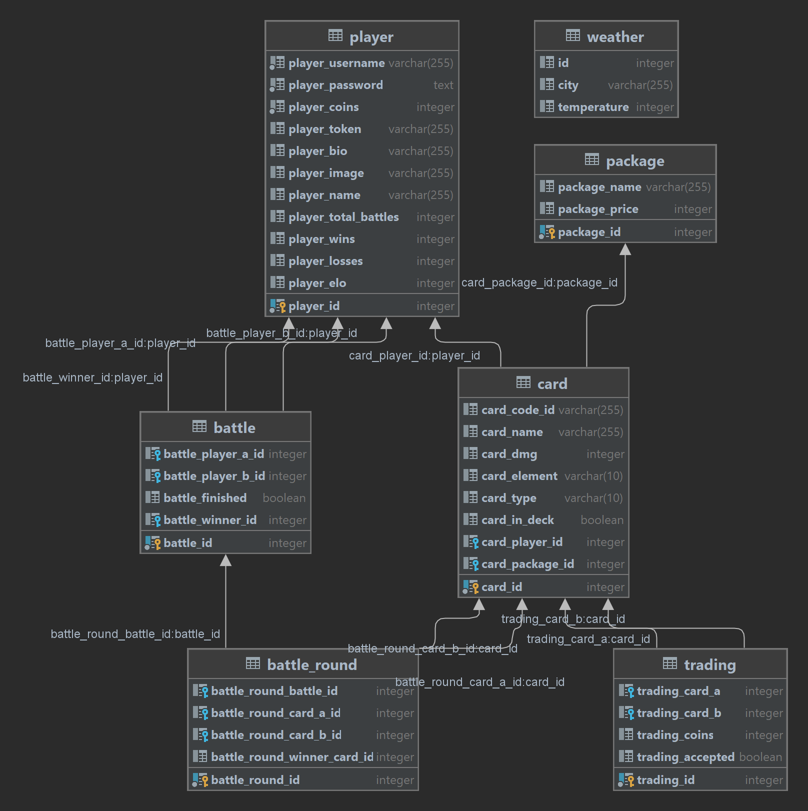

# Monster Trading Card Game
Ein Spiel bei dem man mit Monster- und Zauberkarten gegeneinander antreten und kämpfen kann.

## Summary - Process
Zu Beginn hatte ich große Schwierigkeiten mit dem Verbinden von der Docker DB mit DataGrip.
Nachdem ich PostgresSQL lokal deinstalliert hatte und so keine Error Messages mehr hatte,
konnte ich mit der Implementierung des Spiels beginnen.

Viel Aufwand brauchte ich zu Beginn um die Grundprinzipien der Layered Architecture zu verstehen.
Deshalb brauchte ich etwas mehr Zeit beim User-Service und beim Posten der Daten in die DB.

Session-Service ging ganz flott, viel konnte vom User-Service übernommen werden.

Um den Package-Service zu erstellen, habe ich die DB erweitert, die bis dahin nur aus der
`player` Tabelle mit `username` und `password` existierte. Da für Booster-Packs auch Karten nötig
sind, erstellte ich auch diese Tabelle und die geplanten restlichen Tabellen (Battle, Trading etc.).

Das Erstellen von Booster-Packs erforderte das Token-System, Erstellen von Packs und Erstellen
von Karten die in den Packs sind. Das Hinzufügen der Karten in die Packs erwies sich etwas
schwieriger als gedacht.

Das Kaufen von Karten konnte etwas vereinfacht werden durch SQL-Commands in der DB, z.B. wird
durch `ON DELETE SET NULL` der FK in der Tabelle Cards auf NULL gesetzt, wenn ein Booster Pack
gekauft wird.

Beim Konfigurieren des Decks war es teilweise nervig den Body der Payload zu bekommen, doch das
wirkliche Hinzufügen zum Deck erleichterte sich durch eine gute DB-Architektur.

Das Aktualisieren und anzeigen des User-Profils stellte keine besonderen Herausforderungen dar und
konnte in kurzer Zeit implementiert werden. Viele Funktionen konnten von hier angepasst und dann
auch auf den Stats/Score-Service übertragen werden.

Der Battle-Service war der schwerste Service zum Implementieren. Durch mehrere Spezialregeln war
es schwer eine gute "Codestruktur" zu finden und zu entscheiden wo, was überprüft werden soll.
Obwohl meine derzeitige Lösung gut erweiterbar für weitere "Spezialregeln" ist, bin ich dennoch
nicht zu 100 % mit ihr zufrieden, da es wahrscheinlich noch ein wenig besser geht.

_Trading-Service wird später einmal implementiert._

## Design
### Projekt-Architektur

### Datenbank-Design

## Lessons learned
Nächstes Mal werde ich definitiv für ein Semesterprojekt früher anfangen als knapp 3 Wochen vor
Abgabe. Obwohl es sich alles ohne großen Stress ausgegangen ist, wäre regelmäßiges Feedback zum
Projekt hilfreich gewesen.
Außerdem habe ich durch dieses Projekt gelernt, dass die beste Methode etwas Neues zu programmieren,
das Programmieren selbst ist. Zu Beginn probierte ich auf YouTube und anderen Websites Tutorials 
zu finden. Diese sind zwar gut um ein ungefähres Bild zu bekommen, aber man lernt viel mehr, wenn
man einfach beginnt zu coden, auch wenn man keine Ahnung hat, wo man beginnen soll und was man
eigentlich macht. Nach einer Zeit geht's dann einfach.

* Öfters Debuggen und Code Schritt für Schritt durchgehen
* Ein Feature gleich bestmöglich implementieren
* Andere um Hilfe bitten, wenn man wo länger feststeckt

## Unit Tests
Die Unit-Tests sind z.T. angelehnt an das mitgegebene `YAML` file. Außerdem wurde für jeden Service
ein Test erstellt, um die Authorization zu überprüfen und so eine hohe Sicherheit zu gewährleisten.
Da es beim Spielen zu großer frustration führt, wenn es im Battleverlauf Bugs gibt bezüglich 
DMG-Berechnung, wurden die verschiedenen Battle Spezialitäten und Funktionen ausgiebig getestet.

## Unique Feature
Mein Unique Feature ist, dass es verboten ist zweimal hintereinander die gleiche Karte zu spielen,
wenn man mehr Karten als der Gegner hat. Damit wird (ein wenig) verhindert, dass wenn ein Spieler
mit wenig Erfahrung mit nur einer guten Karte einen erfahrenen Spieler schnell besiegen kann und
gezwungen auch andere Karten zu benutzen. Außerdem erhöht es auch ein wenig das "Ausspielpotenzial".

_(Zurzeit wird zufällig ausgewählt welche Karte gespielt wird. Bei einer Erweiterung des Projekts
wo zwei wirkliche Spieler gegeneinander spielen, ist das Feature sicher besser.)_

## Tracked Time

| Date        | Time [h]  | Comment	                                             |
|-------------|-----------|------------------------------------------------------|
| 23.12-24.12 | 16        | Setting up Database and connecting it to the Project |
| 24.12       | 1         | Creating basic 'player' table in DB                  |
| 24.12-25.12 | 12        | User-Service                                         |
| 25.12       | 3	        | Session-Service, little adjusting of User-Service    |
| 26.12       | 2,5       | Planning and creating final DB-structure and tables  |
| 26.12       | 4	        | Token-based authentication                           |
| 26.12       | 3	        | Creating Booster-Packs (without cards)               |
| 26.12-27.12 | 8	        | Cards are created and added to the Booster Packs	    |
| 28.12       | 4,5       | Transaction-Service	                                 |
| 29.12       | 1	        | Display acquired cards	                              |
| 29.12       | 3,5       | Deck-Service	                                        |
| 05.01       | 2	        | Stats/Score-Service                                  |
| 05.01-08.01 | 19	       | Battle-Service	                                      |
| 08.01       | 3	        | Unit-Tests	                                          |
| /           | 14	       | Bug-Fixing, small adjustments, Protocol, etc.	       |
| **Overall** | **96.5**	 | 	                                                    |
